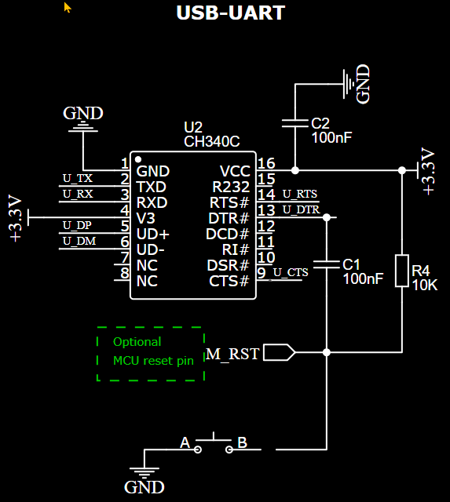

 
## CH340C application example

 
## Pinouts
 
Pin|Label|Input/Output|Description
|---|----|------------|----------|
U_DP|USB DP
U_DM|USB DM
U_RX|Input|Serial Receive
U_TX|Output|Serial Transmit
U_DTR|Output|Data Terminal Ready, Active Low
U_RTS|Input|Request To Send, Active Low
U_CTS|Input|Clear To Send, Active Low
VCC|Supply Output|Power supply 3.3V (Default) or 5V
GND|Supply Output|Ground (0V) supply